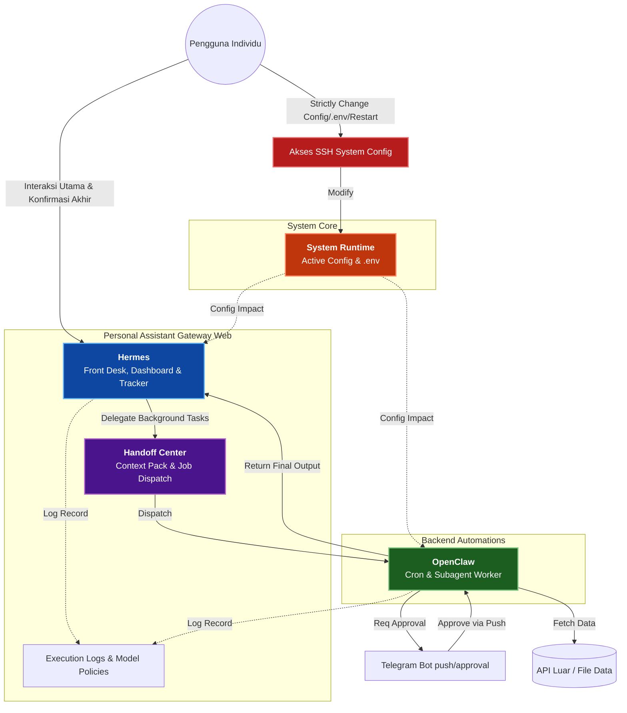
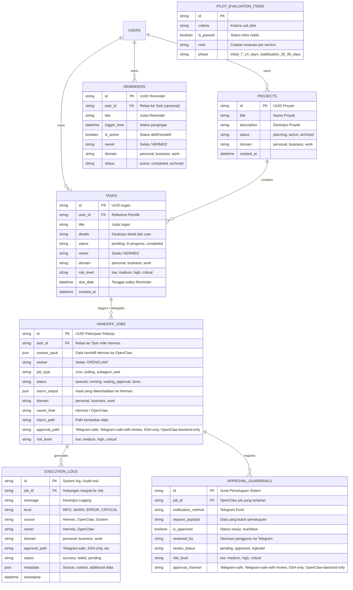

# PRD — Project Requirements Document

## 1. Overview
Aplikasi **"Personal Assistant Gateway"** adalah sebuah web dashboard modern, tertutup (admin panel pribadi), dan eksklusif yang dirancang untuk mengelola ekosistem asisten kecerdasan buatan (AI) hibrida. Masalah utama yang ingin diselesaikan adalah tumpang tindihnya peran antara interaksi langsung dengan asisten utama dan proses otomasi di belakang layar yang berjalan tanpa henti (cron/worker). 

Solusinya adalah membangun sistem dengan arsitektur peran yang sangat tegas: **Hermes** bertindak sebagai *"Front Desk"* (satu-satunya pengelola task, reminder, dan interaksi pengguna), sementara **OpenClaw** bertindak sebagai *"Backend Worker"* (hanya menangani cron, polling, subagent, dan otomasi). Dashboard ini akan menjadi pusat kontrol, pelacakan proses (handoff), kebijakan penggunaan model, dan pusat persetujuan (approval guardrails) bagi pemilik individu, memastikan AI bekerja dengan batas wewenang yang jelas tanpa insiden destruktif.

## 2. Requirements
1. **Pemilik Tunggal (Single Source of Truth):** Hermes adalah satu-satunya entitas yang memiliki Hak atas *Reminder*, *Task Dashboard*, dan *Project Tracker*. Dilarang keras membuat sistem pelacakan (tracker/reminder) paralel untuk OpenClaw.
2. **Arsitektur Handoff Master-Slave:** Semua *mixed task* harus berujung kembali ke Hermes. OpenClaw bekerja di latar belakang (dispatch), dan output pentingnya harus selalu dikembalikan kepada Hermes untuk disajikan ke pengguna.
3. **Pemisahan Jalur Approval:** Terdapat batasan keamanan yang jelas. Interaksi harian dan approval task standar push notifikasi dapat dilakukan via **Telegram** (khusus jalur Telegram-safe). Namun, pengaturan sistem inti (perubahan file aktif, `.env`, restart service, *routing change*) **HANYA** dapat dilakukan melalui akses SSH manual secara langsung oleh pemilik sesudah proses *review*. Aksi runtime/config aktif tidak dapat disetujui penuh dari dashboard/Telegram.
4. **Alokasi Pijakan Model (Model Policy):** Task sensitif dan user-facing wajib melalui high-tier path yang dikendalikan Hermes. OpenClaw dapat memakai high-tier path untuk backend penting, dan hanya boleh memakai cheap worker untuk bounded backend tasks dengan guardrails ketat.
5. **Kriteria Sukses Pilot & Timeline:** 
    - **Pilot Awal (7-14 Hari):** Pada akhir masa uji coba awal, pilot dianggap berhasil jika: (a) Tidak ada reminder/tracker ganda, (b) Output kembali ke Hermes dengan rapi, (c) Flow split antara Telegram dan SSH dipahami tanpa kebingungan, dan (d) Tidak ada eksekusi otomasi destruktif tanpa izin.
    - **Stabilisasi (30-90 Hari):** Masa review lanjutan untuk memastikan konsistensi sistem tanpa kegagalan kritis.
6. **Antarmuka Minimalis & Gelap:** UI/UX menuntut desain yang *clean*, *modern*, *polished*, dan mengusung *Dark Mode* untuk panel administrasi pribadi menggunakan *mock data* di fase awal pengembangan.

## 3. Core Features
- **Dashboard Overview:** Metrik utama yang menunjukkan status sistem, aktivitas Hermes saat ini, dan status kerja *background* OpenClaw. 
- **Reminders & Tasks (Hermes-Owned):** Tabel dan kalender manajemen tugas eksklusif yang sepenuhnya dikendalikan oleh Hermes.
- **Projects Tracker:** Pelacakan proyek jangka panjang dengan atribut domain dan status progres.
- **Cron & Jobs (OpenClaw-owned):** Panel pemantauan layanan yang berjalan otomatis secara berkala (polling, web scraping, data fetching dari API/File).
- **Handoff Center (Hermes -> OpenClaw):** Fitur berupa paket konteks (*handoff context pack*) ketika Hermes melakukan *job dispatch* atau mendelegasikan perintah kepada OpenClaw.
- **Execution Logs:** Catatan aktivitas visual yang merinci apa yang sedang/sudah dikerjakan oleh sistem asisten (Hermes) dan backend (OpenClaw) dengan metadata lengkap.
- **Approval & Guardrails:** Pusat *Review* di dashboard (dan via koneksi Telegram) yang menahan eksekusi sebelum sistem mengambil tindakan penting.
- **Model Policy & Governance (SOP):** Panel panduan regulasi mandiri untuk mengatur model (contoh: kapan memakai tier mahal vs murah) serta SOP aturan main bagi asisten.
- **Pilot Evaluation Checklist:** Halaman khusus dengan *checklist* iteratif untuk memastikan semua kriteria *Pilot Success* terpenuhi tanpa pelanggaran batasan tugas.

## 4. User Flow
1. **Login & Tinjauan Ekosistem:** Pengguna login ke dalam Admin Panel dan langsung melihat **Dashboard Overview**. Di sini terlihat sapaan dari Hermes dan status *worker* OpenClaw yang aktif.
2. **Membuat & Mendelegasikan Task:** Pengguna menambahkan tugas baru (misal: "Riset tren pasar crypto mingguan"). Tugas ini masuk ke **Task Dashboard (Hermes)**.
3. **Proses Handoff:** Hermes menganalisis bahwa ini butuh *polling* harian. Melalui **Handoff Center**, Hermes "membungkus" instruksi tersebut dan mengirim (*Job Dispatch*) ke **OpenClaw**.
4. **Pekerjaan Latar Belakang & Approval:** OpenClaw menjalankan pekerjaan sesuai jadwal (Cron). Saat OpenClaw akan menyimpan data besar atau butuh otorisasi (Guardrails), sistem mengirimkan ringkasan Approval melalui notifikasi **Telegram** (khusus jalur Telegram-safe). Pengguna menekan tombol "Approve" via Telegram. Aksi runtime/config aktif tetap tidak dapat disetujui penuh dari dashboard/Telegram dan harus naik ke SSH/manual review.
    - *Catatan:* Approval via Telegram hanya berlaku untuk task yang memang masuk jalur Telegram-safe atau Telegram-safe-with-review. Aksi runtime/config aktif tetap tidak dapat disetujui penuh dari dashboard/Telegram dan harus naik ke SSH/manual review.
5. **Output Diserahkan: OpenClaw** mengembalikan hasil riset tersebut kepada Hermes. Hermes memperbarui status di *Project Tracker* dan menyajikan ringkasan *"User-Facing Final Output"* untuk dibaca pemilik di Dashboard.
6. **Evaluasi Sistem (SSH):** Jika pengguna merasa perlu mengubah kredensial API atau mengubah *routing* OpenClaw, pengguna meninggalkan Web Dashboard dan membuka terminal untuk melakukan *SSH-only configuration*. Perubahan konfigurasi sistem inti tidak dapat dilakukan via Telegram.

## 5. Architecture

Diagram di bawah ini menggambarkan alur kerja *Personal Assistant Gateway*, mendemonstrasikan bagaimana interaksi eksternal (Telegram) dan internal dipisahkan antara Master (Hermes) dan Worker (OpenClaw), serta bagaimana konfigurasi sistem dikelola secara terpusat via SSH.

## 6. Database Schema

Skema di bawah sangat difokuskan terhadap pemisahan wilayah yang dimiliki Hermes (`Tasks`, `Projects`, `Reminders`) dan wilayah kerja OpenClaw (`Jobs`, `CronSettings`). Schema ini telah diperbarui untuk mendukung filter UI dan terminologi SOP approval.

## 7. MVP Scope (Phase 1)
Fase pertama pengembangan difokuskan pada **Frontend-first prototype** untuk memvalidasi arsitektur informasi dan UX sebelum integrasi backend yang kompleks.

- **Frontend Only:** Pengembangan difokuskan pada antarmuka pengguna (UI) menggunakan Next.js.
- **Mock Data:** Seluruh data yang ditampilkan (Tasks, Logs, Projects) menggunakan data statis/mock untuk simulasi.
- **No Real Integrations:** 
    - Tidak ada integrasi real Telegram Bot (notifikasi disimulasikan di UI).
    - Tidak ada akses SSH real dari dashboard.
    - Tidak ada orchestrasi worker daemon real (OpenClaw disimulasikan).
- **Read-Only / Simulated States:** Fungsi approval dan konfigurasi bersifat simulasi (hanya mengubah state UI, tidak mengeksekusi aksi destruktif).
- **Focus:** Kejelasan arsitektur informasi, validasi alur handoff Hermes-OpenClaw, dan kepatuhan terhadap desain *Dark Mode* yang polished.

## 8. Tech Stack
Meskipun pengguna meminta "AI-pilih", sebagian besar perannya sudah diarahkan kepada stack berbasis JavaScript/TypeScript yang kuat dalam ekosistem Next.js.

- **Bahasa Pemrograman:** TypeScript (untuk keamanan tipe tipe handoff master-worker).
- **Frontend Framework:** Next.js (App Router), sangat cocok untuk antarmuka yang tersentralisasi.
- **Tampilan Umum (UI):** Tailwind CSS digabungkan dengan `shadcn/ui` (memberikan tampilan *clean, modern, polished*, *admiral dark mode*, dan kompenen yang modular). Icon memakai `lucide-react`.
- **Backend / API Wrapper:** Next.js Route Handlers (atau tRPC jika dibutuhkan integrasi TypeScript langsung), cukup untuk mengatur *API Wrapper* Telegram dan *Mock Data*.
- **Database Utama:** SQLite (cepat, berjalan secara individual untuk skenario 1 orang / personal assistant) diintegrasikan dengan **Drizzle ORM** untuk pembuatan skema yang mudah direfaktor di masa depan.
- **Autentikasi:** Better Auth (untuk menjaga gerbang dashboard secara sederhana tapi aman).
- **Integrasi Pihak Ketiga:** Telegram Bot API (untuk pengiriman notifikasi persetujuan /*Guardrail Approvals* - *Simulated in Phase 1*).
- **Sistem Latar Belakang (Worker):** Penggunaan *Cron-job* / *Worker Daemon* terluar, Node.js worker sederhana (atau PM2 process) yang dipasang pada sebuah Virtual Private Server (VPS) sehingga pemilik dapat mendemonstrasikan akses operasional **SSH-only** untuk `.env` dan konfigurasi *service restart*.

## 9. Acceptance Criteria
Kriteria penerimaan spesifik untuk memastikan halaman dan fitur dianggap selesai dibangun pada fase MVP.

### Dashboard Overview
- [ ] Menampilkan minimum **6 cards** metrik utama (Status Sistem, Active Hermes Tasks, Active OpenClaw Jobs, Pending Approvals, Recent Logs Count, System Health).
- [ ] Menampilkan **Recent Logs** minimal 10 item terakhir dengan format warna sesuai level (INFO, WARN, ERROR).
- [ ] Ada **Warning Card** khusus yang muncul jika terdapat aksi berisiko tinggi (High Risk) yang tertunda.
- [ ] Semua label ownership (Hermes vs OpenClaw) terlihat jelas.

### Reminders & Tasks
- [ ] Fungsi Create, Edit, Pause, Archive berjalan pada **mock data**.
- [ ] Semua reminder dan task yang ditampilkan wajib memiliki label **Owner = Hermes**.
- [ ] Tersedia filter berdasarkan **Domain** (Personal, Business, Work) dan **Status**.
- [ ] Form input task memiliki field pemilihan **Risk Level**.
- [ ] Tabel Reminder memiliki kolom **Domain** dan **Status** yang terlihat.

### Jobs & Handoff
- [ ] Semua jobs background ditampilkan dengan label **Owner = OpenClaw**.
- [ ] Job yang merupakan hasil delegasi (Mixed Jobs) memiliki label **"Return to Hermes"**.
- [ ] Job dengan **Risk Level Tinggi** menampilkan warning visual distinct (misal: border merah atau icon Alert).
- [ ] Simulasi approval menunjukkan perbedaan jalur antara **Telegram-Safe** dan **SSH-Required**.
- [ ] Field `approval_path` menampilkan istilah SOP: 'Telegram-safe', 'Telegram-safe-with-review', 'SSH-only', 'OpenClaw-backend-only'.

### Execution Logs
- [ ] Tabel log dapat difilter berdasarkan **Owner** (Hermes/OpenClaw), **Domain**, **Risk**, dan **Status**.
- [ ] Klik pada item log membuka **Detail Drawer** yang menampilkan metadata lengkap (source, approval_path, touched runtime/config).
- [ ] Field `source`, `owner`, `domain`, `approval_path`, dan `status` terlihat jelas di daftar log.
- [ ] Warna baris log menyesuaikan level (INFO=biru, WARN=kuning, ERROR=merah).

### Approval & Guardrails
- [ ] Halaman menampilkan kategori approval sesuai 4 jalur SOP: **Telegram-safe**, **Telegram-safe-with-review**, **SSH-only**, **OpenClaw-backend-only**.
- [ ] Item dengan **High-Risk Action** memiliki visual warning yang jelas (misal: badge merah atau icon gembok).
- [ ] Status review (pending, approved, rejected) terlihat pada setiap item guardrail.
- [ ] Simulasi tombol approve/reject hanya mengubah state UI (tidak ada eksekusi nyata).

### Model Policy & Governance
- [ ] Halaman ditampilkan sebagai **Read-Only** (tidak ada form edit aktif di MVP).
- [ ] Aturan **Cheap Worker Rules** terlihat jelas (contoh: "Only for bounded backend tasks").
- [ ] Kebijakan model High-Tier untuk Hermes dan OpenClaw dijelaskan secara eksplisit.
- [ ] Desain sesuai tema *Dark Mode* yang polished.

### Pilot Evaluation Checklist
- [ ] Setiap item kriteria pilot dapat **dicentang** (checkbox interaktif).
- [ ] Setiap section kriteria memiliki **Field Note** untuk catatan evaluasi.
- [ ] Terdapat indikator progres keseluruhan (misal: "5/10 Criteria Passed").
- [ ] Phase (Initial 7-14 Days vs Stabilization 30-90 Days) terpisah dengan jelas.